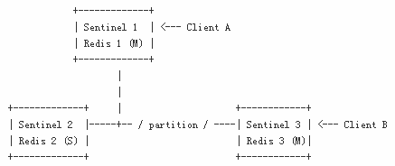

# 高可用（下）

## 分割下的一致性(Consistency under partitions) 

Redis Sentinel 的配置是最终一致性的，所以每个分区会被统一到一个可用的更高版本的配置。但是，在使用 Sentinel 的真实世界系统中有三个不同的角色： 

- Redis 实例。
- Sentinel 实例。
- 客户端。

为了定义系统的行为，我们得考虑这三个角色。 

下面是一个有三个节点的简单网络，每一个节点运行一个 Redis 实例和一个 Sentinel 实例： 



在这个系统中，初始状态是 Redis 3 是主服务器，Redis 1 和 Redis 2 是从服务器。分割发生了，隔断了老的主服务器。Sentinel 1 和 2 开始故障转移，提升 Sentinel 1 作为新的主服务器。 

Sentinel 的属性保证，Sentinel 1 和 2 现在拥有主服务器的最新配置。但是，Sentinel 3 仍是旧的配置，因为它存在于一个不同的分割中。 

当网络分割恢复正常了，Sentinel 3 将会更新其配置，但是，如果有客户端与老的主服务器被分割在一起，在分割期间会发生什么事情呢？ 

客户端会继续向 Redis 3 写，即老的主服务器。当分割又聚合在一起，Redis 3 将会变成 Redis 1 的从服务器，分割期间所有写入的数据会丢失。 

你可能想或者不想这种场景发生，取决于你的配置： 

- 如果你将 Redis 用作缓存，客户端 B 可以继续往老的主服务器写，即使这些数据会丢失。
- 如果你将 Redis 用作存储，这样就不好了，你需要来配置系统以部分地阻止问题的发生。

因为 Redis 是异步复制，这种场景下没有完全阻止数据丢失的办法，但是你可以使用下面的 Redis 配置选项，来限制 Redis 3 和 Redis 1 之间的分歧： 

```
min-slaves-to-write 1  
min-slaves-max-lag 10  
```

有了上面的配置(请查看 Redis 分发版本中自带的 redis.conf 文件中的注释获取更多的信息)，扮演主服务器的 Redis 实例如果不能写入到至少一个从服务器，将会停止接受写请求。由于复制是异步的，不能写入的意思就是从服务器也是断开的，或者在指定的 max-lag 秒数没有发送异步回应 (acknowledges)。 

使用这个配置，上面例子中的 Redis 3 在 10 秒钟之后变得不可用。当分割恢复了，Sentinel 3 的配置将会统一为新的，客户端 B 可以获取合法的配置并且继续。 

## Sentinel 的持久化状态 (Sentinel persistent state) 

Sentinel 的状态被持久化在 Sentinel 的配置文件中。例如，每次创建(领导者 leader Sentinel)或者收到新的配置，主服务器会将配置连同配置纪元持久化到磁盘中。这意味着，停止和重启 Sentinel 进程是安全的。 

## Sentinel 重配置实例(Sentinel reconfiguration of instances) 

即使没有故障转移在进行中，Sentinel 也会一直尝试在被监控的实例上设置当前配置。尤其是： 

- 声称要成为主服务器的从服务器(根据当前配置)，会被配置为从服务器来复制当前主服务器。
- 连接到错误主服务器的从服务器，会被重新配置来复制正确的主服务器。
- 为了 Sentinel 重新配置从服务器，错误的配置必须要观察一段时间，一段大于用于广播新配置所使用的时间。

这防止了持有旧配置(例如，因为刚刚从分割中恢复)的 Sentinel 会尝试在收到变更之前改变从服务器的配置。 

也要注意，一直尝试使用当前配置使得故障转移对分割具有更强的抵抗力的语义是什么： 

- 被故障转移的主服务器当再次可用时被重新配置成从服务器。
- 被分割的从服务器在一旦可到达时被重新配置。

## 从服务器的选举和优先级(Slave selection and priority) 

当 Sentinel 实例准备执行故障转移，也就是当主服务器处于 ODOWN 状态，并且 Sentinel 从大多数已知 Sentinel 实例收到了故障转移授权，需要选择一个合适的从服务器。 

从服务器的选择过程评估从服务器的以下信息： 

1. 从主服务器断开的时间。
2. 从服务器的优先级。
3. 已处理的复制偏移量。
4. 运行 ID。

一个从服务器被发现从主服务器断开超过十倍于配置的主服务器超时(down-after-milliseconds 选项)，加上从正在执行故障转移的 Sentinel 的角度来看主服务器也不可用的时间，将会被认为不适合用于故障转移并跳过。 

更严谨地说，一个从服务器的 INFO 输出表明已从主服务器断开超过： 

```
(down-after-milliseconds * 10) + milliseconds_since_master_is_in_SDOWN_state  
```

就被认为不可靠并且被抛弃。 

从服务器选择只考虑通过了上面测试的从服务器，并且基于上面的标准排序，使用下面的顺序。
 
1. 从服务器按照 Redis 实例的 redis.conf 文件中配置的 slave-priority 排序。更低的优先级更偏爱。
2. 如果优先级相同，将检查已处理的复制偏移量，从主服务器收到更多数据的从服务器将被选择。
3. 如果多个从服务器有相同的优先家，并且从主服务器处理完相同的数据，将执行进一步的检查，选择按照字典顺序具有更小运行 ID 的从服务器。拥有较小的运行 ID 对从服务器并不是一个真正的优势，但是有助于从服务器选举过程更具有确定性，而不是随机选择一个。

如果对机器有强烈的偏好的话，Redis 主服务器(故障转移以后成为从服务器)和从服务器都需要配置 slave-priority。否则，所有的实例都可以使用默认的运行 ID 来运行(这是建议的设置，因为按照复制偏移量来选择从服务器要有趣得多)。 

Redis 实例可以配置一个特殊的 slave-priority 值 0，这样就一定不会被 Sentinel 选举为新的主服务器。但是，按照这样配置的从服务器仍然会被 Sentinel 重新配置，从而在故障转移后复制新的主服务器，唯一的区别是永远不会变成主服务器。 

Sentinel 和 Redis 身份验证(authentication) 

当主服务器被配置为需要客户端传递密码时，作为安全措施，从服务器也需要知道这个密码来验证主服务器，并且创建用于异步复制协议的主从连接。 

使用下面的配置指令完成： 

主服务器中的 requirepass 用来设置密码验证，以确保实例不会处理没有验证过的客户端的请求。
从服务器中的 masterauth 用于从服务器验证主服务器，以正确的从其复制数据。

当使用 Sentinel 就没有单一的主服务器，因为故障转移以后从服务器可以扮演主服务器的角色，老的主服务器被重新配置以扮演从服务器，所以你要做的就是在你所有的主服务器和从服务器实例中设置以上指令。 

这通常是一种逻辑上健全的设置，因为你不想只是保护主服务器中的数据，从服务器中也应拥有同样可访问的数据。 

但是，在一些不常见的情况下，你需要从服务器无需验证就能访问，你仍可以通过设置从服务器的优先级为 0(这将不允许从服务器被提升为主服务器)，只为从服务器配置 masterauth 指令，不配置 requirepass 指令这样来做到，这样数据就可以让未经验证的客户端读取。 

## Sentinel API 

Sentinel 运行默认使用 TCP 端口 26379(注意，6379 是正常的 Redis 端口)。Sentinel 接受使用 Redis 协议的命令，所以你可以使用 redis-cli 或者任何其他未修改的 Redis 客户端与 Sentinel 对话。 

有两种方式与 Sentinel 对话：可以直接查询它来检查被监控的 Redis 实例的状态，看看它知道的其他 Sentinel，等等。 

另外一种方式是使用发布订阅，每当某个事件发生时，例如故障转移，或者一个实例进入到了一个错误条件，等等，接收从 Sentinel 推过来的通知。 

## Sentinel 命令 

下面是可接受的命令清单： 

- PING：这个命令仅仅返回 PONG。
- SENTINEL masters：展示被监控的主服务器列表及其状态。
- SENTINEL master <master name\>：展示指定主服务器的状态和信息。
- SENTINEL slaves <master name\>：展示指定主服务器的从服务器列表及其状态。
- SENTINEL get-master-addr-by-name <master name\>：根据名字返回主服务器的 IP 地址和端口号。如果这台主服务器正在故障转移过程中或者成功结束了，返回被提升的从服务器的 IP 地址和端口。
- SENTINEL reset <pattern\>：这个命令根据匹配的名字重置所有主服务器。pattern 参数是通配符风格(glob-style)。重置进程清除主服务器的任何先前状态(包括进行中的故障转移)，移除每一个主服务器上被发现和关联的从服务器和 Sentinel。
- SENTINEL failover <master name\> 当主服务器不可达时强制故障转移，无需要求其他的
- Sentinel 同意(但是会发布一个新的配置版本，这样其他 Sentinel 就会更新它们的配置)。

## 运行时重配置 Sentinel(Reconfiguring Sentinel) 

从 Redis 2.8.4 开始，Sentinel 提供了用于添加，删除和改变指定主服务器配置的 API。注意，如果你有多个 Sentinel 实例，你得将改变应用到所有的 Redis Sentinel 实例才能运转正常。也就是说，改变一个 Sentinel 的配置不会自动传播到网络中的其它 Sentinel。 

下面是 SENTINEL 的子命令清单，用于更新 Sentinel 实例的配置。 

- SENTINEL MONITOR <name\> <ip\> <port\> <quorum\>：这个命令告诉 Sentinel 开始监控一个指定名字，IP 地址，端口和仲裁人数的新主服务器。这等同于 sentinel.conf 配置文件中的 sentinel monitor 配置指令，不同之处在于此处不能使用主机名作为 IP 地址，你需要提供一个 IPv4 或者 Ipv6 地址。
- SENTINEL REMOVE <name\>：用于删除指定主服务器：主服务器不再被监控，完全从 Sentinel 内部状态中移除，所以不会被 SENTINEL masters 列出，等等。
- SENTINEL SET <name\> <option\> <value\>：命令 SET 非常类似于 Redis 的 CONFIG SET 命令，用于改变指定主服务器的配置参数。可以指定多个选项 - 值对(或者根本啥都没有)。所有可以通过 sentinel.conf 配置的配置参数都可以通过 SET 命令配置。

下面是 SENTINEL SET 命令的一个例子，用于修改一个名为 objects-cache 的主服务器的 down-after-milliseconds 配置： 

```
SENTINEL SET objects-cache-master down-after-milliseconds 1000  
```

启动以后，SENTINEL SET 能用于设置所有在启动配置文件中可设置的配置参数。此外，还可以仅仅只改变主服务器的仲裁人数配置，而不需要使用 SENTINEL REMOVE 和 SENTINEL MONITOR 来删除和重新添加主服务器，而只需要： 

```
SENTINEL SET objects-cache-master quorum 5  
```

注意，没有与之等价的 GET 命令，因为 SENTINEL MASTER 以一种易于解析的格式(作为一个字段 - 值对数组)提供了所有的配置参数。 

## 添加和删除 Sentinel(Adding or removing Sentinels) 

因为 Sentinel 实现的自动发现机制，添加一个新的 Sentinel 到你的部署中是一个很简单的过程。所有你需要干的就是启动一个配置用于监控当前活跃主服务器的 Sentinel。在 10 秒钟之内，Sentinel 就会获得其他 Sentinel 的列表以及连接到主服务器的从服务器集合。 

如果你想一次添加多个新的 Sentinel，建议一个一个的添加，等待所有其他的 Sentinel 知道了第一个再添加另一个。这在当添加新 Sentinel 的过程中发生错误时，仍然保证在分割的一侧能达到大多数时很有用。 

在没有网络分割时，这可以通过添加每个新的 Sentinel 时带 30 秒的延迟来轻易实现。 

在最后，可以使用命令 SENTINEL MASTER mastername 来检查是否所有的 Sentinel 就监控主服务器的 Sentinel 数量达成一致。 

删除一个 Sentinel 要稍微复杂一些：Sentinel 永远不会忘记已经发现的 Sentinel，即使他们在很长一段时间内都不可达，因为我们不想动态改变用于授权故障转移所需要的大多数以及创建新的配置版本。所以在没有网络分割情况下，需要执行下面的步骤来删除 Sentinel： 

1. 停止你想删除的 Sentinel 的进程。
2. 发送 SENTINEL RESET * 命令到所有其他的 Sentinel 实例(如果你想重置单个主服务器可以使用精确的主服务器名来代替 *)。一个一个的来，前后等待至少 30 秒。
3. 通过检查每个 SENTINEL MASTER mastername 的输出，来检查所有的 Sentinel 就当前活跃的 Sentinel 数量达成一致。

## 删除旧的主服务器或不可达从服务器(unreachable) 

Sentinel 不会忘记主服务器的从服务器，即使在很长时间内都不可达。这很有用，因为这样 Sentinel 能够在网络分割或者错误事件恢复后正确地重新配置一个返回的从服务器。 

此外，故障转移之后，被故障转移的主服务器事实上被添加为新主服务器的从服务器，这样一旦恢复重新可用，就会被重新配置来复制新的主服务器。 

但是，有时候你想从 Sentinel 监控的从服务器列表中永久删除一个从服务器(可能是旧的主服务器)。 

要做到这个，你需要发送 SENTINEL RESET mastername 命令到所有的 Sentinel：在接下来的 10 秒内，他们会刷新从服务器列表，只添加当前主服务器 INFO 输出中的正确复制的清单。 

## 发布和订阅消息(Pub/Sub Messages) 

客户端可以将 Sentinel 作为一个 Redis 兼容的发布订阅服务器(但是你不能使用 PUBLISH)来使用，来订阅或者发布到频道，获取指定事件通知。 

频道名称与事件名称是一样的。例如，名为 + sdown 的频道会收到所有关于实例进入 SDOWN 条件的通知。 

简单使用 PSUBSCRIBE * 订阅来获得所有的消息。 

下面是频道的清单，以及使用这个 API 你会收到的消息格式。第一个单词是频道/事件名称，剩下的是数据的格式。 

注意：指定 instance details 的地方表示提供了下面用于表示目标实例的参数： 

```
<instance-type> <name> <ip> <port> @ <master-name> <master-ip> <master-port>  
```

标识主服务器的部分 (从 @参数到结束) 是可选的，只在实例不是主服务器本身时指定。 

- +reset-master <instance details\>：主服务器被重置。
- +slave <instance details\>：一个新的从服务器被发现和关联。
- +failover-state-reconf-slaves <instance details\>：故障转移状态切换为 reconf-slaves 状态。
- +failover-detected <instance details\>：另一个 Sentinel 启动了故障转移，或者任何其它外部实体被发现(关联的从服务器变为主服务器)。
- +slave-reconf-sent <instance details\>：领导者 Sentinel 发送了 SLAVEOF 命令到这个实例，重新配置为新的从服务器。
- +slave-reconf-inprog <instance details\>：从服务器正在重新配置为新的主服务器的从服务器，但是同步过程尚未完成。
- +slave-reconf-done <instance details\>：从服务器完成了与新主服务器的同步。
- -dup-sentinel <instance details\>：由于重复，指定主服务器的一个或多个 Sentinel 被移除。
- +sentinel <instance details\>：这个主服务器的新的 Sentinel 被发现和关联。
- +sdown <instance details\>：指定的实例处于主观下线状态。
- -sdown <instance details\>：指定的实例不再处于主观下线状态。
- +odown <instance details\>：指定的实例处于客观下线状态。
- -odown <instance details\>：指定的实例不再处于客观下线状态。
- +new-epoch <instance details\>：当前纪元被更新。
- +try-failover <instance details\>：新的故障转移进行中，等待被大多数选中。
- +elected-leader <instance details\>：赢得指定纪元的选举，可以进行故障转移。
- +failover-state-select-slave <instance details\>：新的故障转移状态是 select-slave：正在寻找合适的从服务器来提升。
- no-good-slave <instance details\>：没有合适的从服务器来提升。一段时间后会重试，或者干脆放弃故障转移。
- selected-slave <instance details\>：找到合适的从服务器来提升。
- failover-state-send-slaveof-noone <instance details\>：正在重新配置将提升的从服务器为主服务器，等待完成后切换。
- failover-end-for-timeout <instance details\>：故障转移由于超时而终止， 无论如何从服务器最终被配置为复制新的主服务器。
- failover-end <instance details\>：故障转移顺利完成。所有从服务器被重配置为复制新主服务器。
- switch-master <master name\> <oldip\> <oldport\> <newip\> <newport\>：配置变更后主服务器的 IP 和地址都是指定的。这是大多数外部用户感兴趣的消息。
- +tilt：进入 tilt 模式。
- -tilt：退出 tilt 模式。

## TILT 模式 

Redis Sentinel 严重依赖于计算机时间：例如，为了了解一个实例是否可用，Sentinel 会记住最近成功回复 PING 命令的时间，与当前时间对比来了解这有多久。 

但是，如果计算机时间以不可预知的方式改变了，或者计算机非常繁忙，或者某些原因进程阻塞了，Sentinel 可能会开始表现得不可预知。 

TILT 模式是一个特别的保护模式，当发现一些会降低系统可靠性的奇怪问题时，Sentinel 就会进入这种模式。Sentinel 的定时中断通常每秒钟执行 10 次，所以我们期待两次定时中断调用之间相隔 100 毫秒左右。 

Sentinel 做的就是记录上一次定时中断调用的时间，与当前调用进行比较：如果时间差是负数或者出乎意料的大(2 秒或更多)，就进入了 TILT 模式(或者如果已经进入了，退出 TILT 模式将被推迟)。 

当处于 TILT 模式时，Sentinel 会继续监控一切，但是： 

- 停止一切动作。
- 开始回复负数给 SENTINEL is-master-down-by-addr 请求，因为检测失败的能力不再可信了。

如果一切表现正常了 30 秒，将退出 TILT 模式。 

## 处理 - BUSY 状态 

(警告：还未实现) 

当脚本运行超过配置的脚本限制时间时返回 - BUSY 错误。当这种情况发生时，在触发故障转移之前 Redis Sentinel 会尝试发送 SCRIPT KILL 命令，这只有在脚本是只读的情况下才能成功。 

## Sentinel 客户端实现 

Sentinel 需要显式的客户端支持，除非系统被配置为执行一个脚本，来实现透明重定向所有请求到新的主服务器实例(虚拟 IP 或其它类似系统)。客户端库实现的主题在 Sentinel 客户端指引手册中讨论(请期待本系列后续文档，译者注)。 